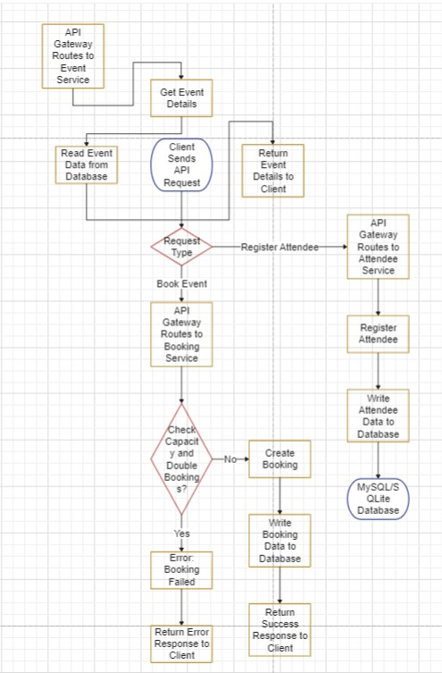

# 📅 Laravel Event Booking API

A simple RESTful API for managing events, attendees, and event bookings using Laravel.

---

## 🚀 Features

- Country-based event locations (no specific addresses)
- Booking with capacity limit
- Prevent duplicate bookings
- Full CRUD for Events
- Structured, meaningful JSON responses
- Fully tested with PHPUnit
- Auto-generated API documentation using Scribe

---

## 🛠️ Requirements

- PHP 8.1+
- Composer
- Laravel 10+
- MySQL or PostgreSQL
- Node.js (for Laravel Mix if using frontend)

---

## ⚙️ Setup Instructions

```bash
# Clone the repository
git clone https://github.com/your-username/laravel-event-booking.git
cd laravel-event-booking

# Install dependencies
composer install

# Copy environment file and configure
cp .env.example .env

# Generate app key
php artisan key:generate

# Configure your .env (DB settings etc.)

# Run migrations
php artisan migrate

# (Optional) Seed database
php artisan db:seed

# Run tests
php artisan test


The following test cases are covered under BookingTest.php:

Test Name	Description
test_user_can_book_event	Verifies a user can successfully book an event with available capacity.
test_user_cannot_double_book_same_event	Ensures a user cannot book the same event more than once.
test_booking_fails_when_event_full	Prevents bookings once an event reaches its full capacity.
test_booking_fails_with_invalid_ids	Validates that booking fails when invalid event_id or attendee_id is provided.
test_booking_requires_required_fields	Ensures both event_id and attendee_id are required.
test_concurrent_bookings_respect_capacity	Confirms that simultaneous booking attempts still respect event capacity limits.
test_show_booking_details	Fetches and displays details for a specific booking.
test_user_can_cancel_booking	Allows users to cancel (delete) a booking.
test_user_cannot_book_past_event	Prevents booking for events that have already started (past start_time).


## 📊 System Architecture

This is a diagram of the booking system's architecture:




Postman collection: postman/collection.json

## 📦 Postman API Collection

Use the following Postman collection to test all Booking APIs:

👉 [Download Booking API Collection](postman/booking-api.postman_collection.json)

### How to Use
1. Download the collection above
2. Open [Postman](https://www.postman.com/)
3. Click `Import` → Upload the JSON file
4. Start testing your endpoints!

---

### 📘 Available Endpoints

#### 🎟️ Bookings
| Method | Endpoint         | Description                      |
|--------|------------------|----------------------------------|
| POST   | `/api/bookings`  | Book an attendee for an event   |
| GET    | `/api/bookings/{id}` | Get booking details        |
| DELETE | `/api/bookings/{id}` | Cancel a booking           |

#### 📅 Events
| Method | Endpoint        | Description             |
|--------|-----------------|-------------------------|
| GET    | `/api/events`   | Get all events          |
| POST   | `/api/events`   | Create a new event      |

#### 👤 Attendees
| Method | Endpoint         | Description             |
|--------|------------------|-------------------------|
| GET    | `/api/attendees` | List all attendees      |
| POST   | `/api/attendees` | Register a new attendee |

